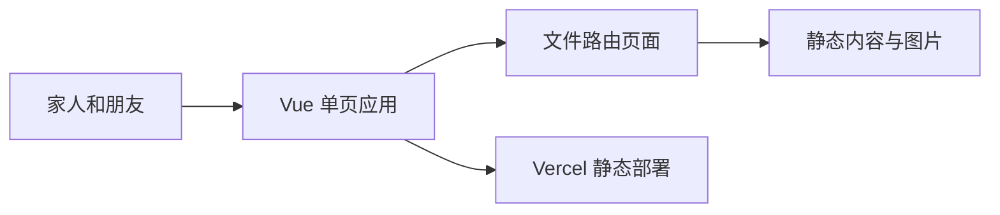

# 架构地图

## 系统边界

Yang ChuRan 是一个部署在 Vercel 上的静态前端站点，用来记录楚然的成长。它没有后端服务、数据库或用户账户；页面内容来自仓库中的静态数据和图片资源，由浏览器直接呈现。



## 代码布局

```text
src/
├── pages/          # 首页、时间线、照片页、生日页与 404 页面
├── components/     # 首页、生日、装饰和图标组件
├── composables/    # 动画与交互逻辑
├── data/           # 时间线、生日和首页内容
├── utils/          # 与页面无关的纯逻辑
├── assets/         # 全局样式和随构建发布的资源
├── types/          # 环境与自动生成的类型声明
├── App.vue         # 应用壳，承载 RouterView
└── main.ts         # 创建 Vue 应用与文件路由
```

## 依赖方向

- 页面负责组合组件、内容、交互逻辑和资源。
- 组件可以复用 composable、静态内容和资源，但不依赖某个具体页面。
- `data/` 与 `utils/` 不依赖页面或组件，保持可单独测试。
- 路由由 `src/pages/` 的文件生成；自动生成的类型声明不手工编辑。
- 站点内容保持静态，新增内容优先补充数据、页面和图片，而不是增加服务端状态。

## 技术边界

当前实现使用 Vue 3、Vue Router 5、Vite 8、Tailwind CSS 4、DaisyUI 5 和 GSAP。构建配置固定既有浏览器兼容基线，部署保持为 Vercel 的静态 SPA。具体依赖与验证记录归入 [docs](./docs/README.md)，不在本文件重复维护版本清单。

## 相关文档

- [业务领域](./docs/DOMAINS.md)
- [工程信条](./docs/design-docs/core-beliefs.md)
- [活跃工作](./docs/active/index.md)
