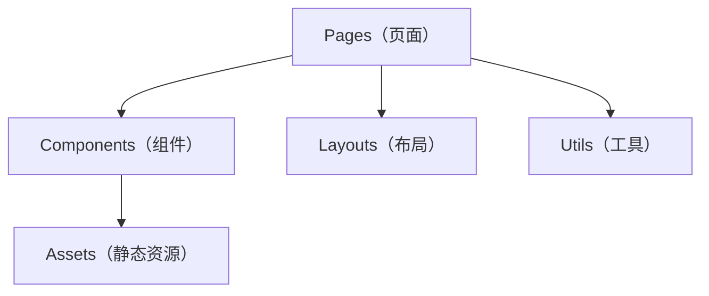

# ARCHITECTURE.md

## 系统概述

Yang ChuRan 是一个纯前端单页应用（SPA），用于记录小女孩的成长历程。无后端服务、无数据库，所有内容为静态数据，构建产物部署在 Vercel CDN 上。

目标用户：家人和朋友。核心功能：成长时间线、生日祝福页、照片手风琴展示、倒计时。

技术选型以"简单、现代、零运维"为原则：Vue 3 Composition API + TypeScript + Tailwind CSS 4 + DaisyUI 5。

## 项目结构

```
project-root/
├── src/
│   ├── pages/              # 文件路由页面（自动生成路由）
│   │   ├── index.vue       # 首页
│   │   ├── timeline.vue    # 成长时间线
│   │   ├── accordion.vue   # 照片手风琴
│   │   ├── countdown.vue   # 倒计时
│   │   ├── birthday/       # 生日相关页面
│   │   └── error/          # 错误页面
│   ├── components/         # 通用组件
│   │   └── icons/          # SVG 图标组件
│   ├── layouts/            # 布局组件（default.vue）
│   ├── assets/             # 静态资源（CSS、图片）
│   ├── util/               # 工具函数
│   ├── types/              # TypeScript 类型声明（自动生成）
│   ├── App.vue             # 根组件
│   └── main.ts             # 应用入口
├── public/                 # 公共静态资源
├── docs/                   # 项目文档
├── AGENTS.md               # 智能体入口
└── ARCHITECTURE.md         # 本文件
```

## 分层模型



**依赖规则：**

- Pages 可以依赖 Components、Layouts、Utils、Assets
- Components 可以依赖 Assets
- 不存在跨页面依赖（每个页面是独立入口）
- 无后端依赖，无 API 层

## 技术栈

| 层级     | 技术                       | 版本/备注                                |
| -------- | -------------------------- | ---------------------------------------- |
| 框架     | Vue 3                      | ^3.5，Composition API + `<script setup>` |
| 路由     | Vue Router 5               | 文件路由（vue-router/vite 内置）         |
| 样式     | Tailwind CSS 4 + DaisyUI 5 | CSS-first 配置，@tailwindcss/postcss     |
| 预处理器 | Less                       | 仅 2 个页面使用                          |
| 工具库   | VueUse                     | 按需使用                                 |
| 构建     | Vite 7                     | esbuild 压缩                             |
| 类型     | TypeScript ~5.9            | 严格模式                                 |
| 部署     | Vercel                     | 静态 SPA，vercel.json 配置 SPA fallback  |

## 模块职责

| 模块              | 职责                           | 依赖                       |
| ----------------- | ------------------------------ | -------------------------- |
| `src/pages/`      | 页面级组件，自动注册为路由     | components, layouts, utils |
| `src/components/` | 可复用 UI 组件                 | assets                     |
| `src/layouts/`    | 页面布局骨架                   | components                 |
| `src/assets/`     | 样式表和图片资源               | 无                         |
| `src/util/`       | 纯函数工具                     | 无                         |
| `src/types/`      | 自动生成的类型声明（禁止手改） | 无                         |

## 关键架构决策

详见 [`docs/design-docs/`](./docs/design-docs/)。
