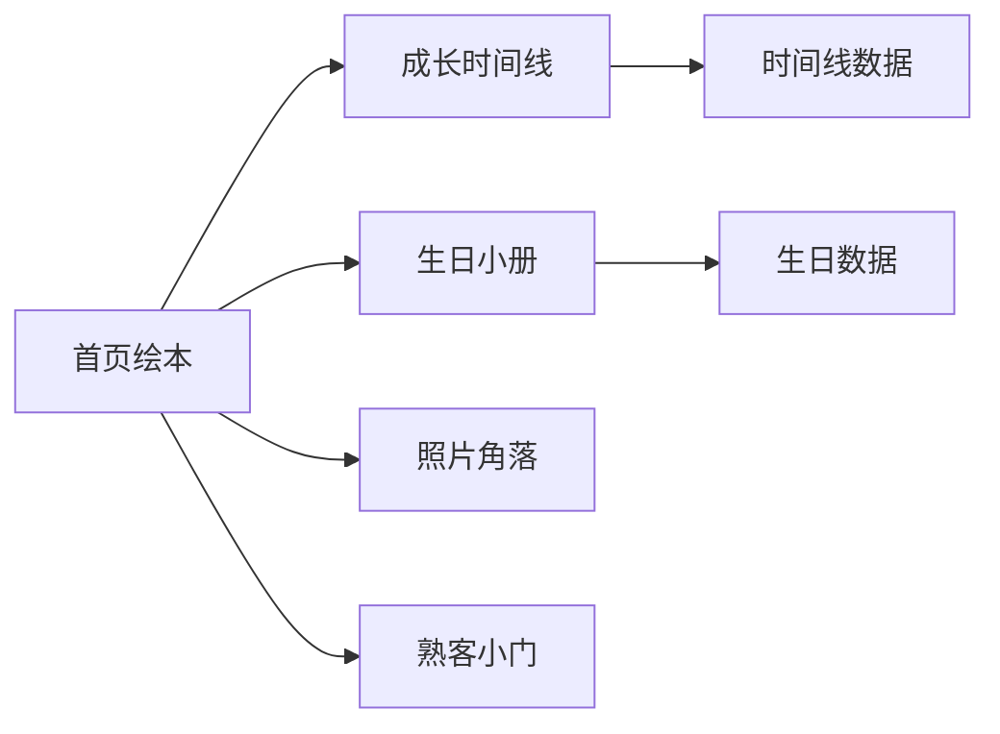

# 业务领域

| 领域       | 面向访客的内容                 | 主要位置                                                                        | 内容来源                      |
| ---------- | ------------------------------ | ------------------------------------------------------------------------------- | ----------------------------- |
| 首页绘本   | 欢迎语、成长故事和导航入口     | `src/pages/index.vue`、`src/components/home/`                                   | `src/data/homeMoments.ts`     |
| 成长时间线 | 按时间串联成长片段             | `src/pages/timeline.vue`                                                        | `src/data/timeline.ts`        |
| 生日小册   | 生日索引与一岁、两岁、三岁页面 | `src/pages/birthday/`、`src/components/birthday/`                               | `src/data/birthdays.ts`       |
| 照片角落   | 手风琴式照片浏览               | `src/pages/accordion.vue`                                                       | 页面与图片资源                |
| 熟客小门   | 首页中的熟人入口与本地校验     | `src/components/home/FamiliarDoorSection.vue`                                   | `src/utils/familiarAccess.ts` |
| 装饰氛围   | 图标、漂浮元素和页面动效       | `src/components/atmosphere/`、`src/components/decorations/`、`src/composables/` | 组件与 composable             |

## 领域协作

各领域通过路由和共享静态数据协作，不共享可变全局状态。跨领域的视觉元素与交互逻辑应下沉到组件或 composable；内容变化优先更新 `data/` 或对应页面。
