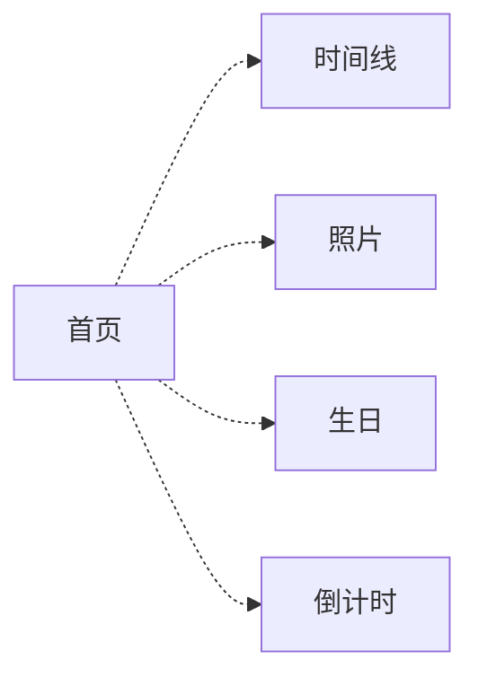

# 业务领域划分

## 领域清单

| 领域       | 职责说明                 | 代码位置                  | 关键实体               |
| ---------- | ------------------------ | ------------------------- | ---------------------- |
| 首页展示   | 时间问候、成长元素可视化 | `src/pages/index.vue`     | 问候语、时间、图标卡片 |
| 成长时间线 | 按时间轴展示成长里程碑   | `src/pages/timeline.vue`  | timelineData           |
| 照片展示   | 手风琴式图片浏览         | `src/pages/accordion.vue` | 图片列表               |
| 生日祝福   | 生日纪念页面             | `src/pages/birthday/`     | 生日动画、祝福内容     |
| 倒计时     | 纪念日倒计时             | `src/pages/countdown.vue` | 目标日期、时间差       |

## 领域间关系

各页面完全独立，无领域间数据依赖。导航通过路由链接关联。

## 领域通信规则

- 各页面是独立入口，不存在跨页面数据传递
- 共享逻辑提取到 `src/util/` 或 `src/components/`
- 无全局状态管理（无 Pinia/Vuex）
