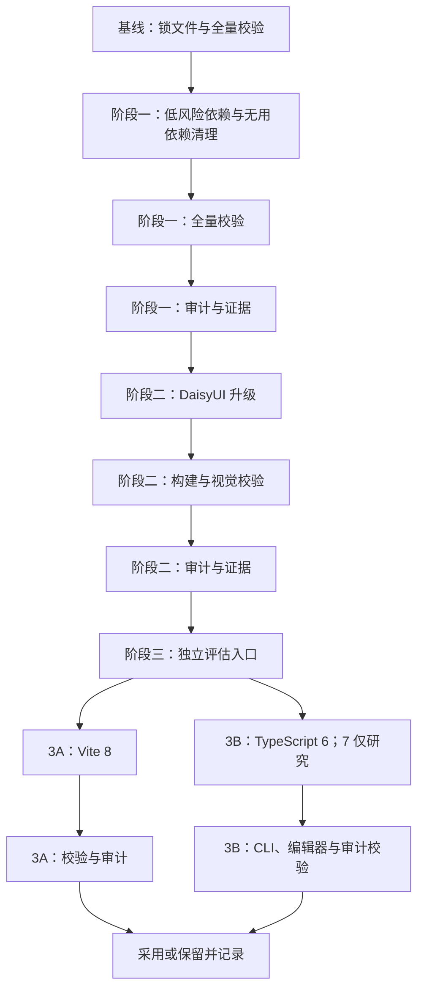

# 分阶段依赖升级

## Context

版本启动时，项目使用 Vue 3、Vue Router 5、Tailwind CSS 4、DaisyUI 5 与 Vite 7。官方 npm 审计在完整安装树中报告了传递依赖告警，候选版本同时包含低风险补丁、小版本更新，以及 Vite 8、TypeScript 6/7 这类需要单独验证的主版本变化。Vite 8 已在 Phase 3A 采用；本文中的 Vite 7 表述均指该阶段的历史基线。

## Goal

在三个编号阶段内完成可兼容的依赖整理，并为每个阶段保留可复核的候选版本、验证结果、审计结果、提交记录和剩余风险说明。第三阶段包含两条互不影响的评估轨道（3A、3B），不改变“三个阶段”的编号。

## Non-Goal

- 不在本版本增加页面、路由或访客访问能力。
- 不以自动安全修复替代人工兼容性验证。
- 不将 TypeScript 7 纳入本版本的默认目标。
- 不在没有记录的情况下改变浏览器兼容基线、构建配置或生产内容。

## Architecture



依赖版本由 `package.json` 输入，pnpm 根据输入解析 `pnpm-lock.yaml`；锁文件不得手工编辑。每个阶段都必须执行全量校验和审计，并将结论写入对应证据文件后才能关闭阶段。阶段三的 3A、3B 可在阶段二完成后分别评估，但每条轨道必须拥有独立的候选变更、证据和结果，不得把一条轨道的通过结论推断给另一条轨道。

### 阶段结果状态

每个阶段或评估轨道只能落在以下两种结果之一：

- `adopt`（采用）：所有适用门槛通过；将精确版本、锁文件和必要配置变更放入该阶段独立提交，并在证据中记录提交 ID。
- `retain-and-record`（保留并记录）：候选不可用、任一门槛失败、外部服务无法验证，或评估结果不足以支持采用；保留进入阶段前的版本，不提交候选变更，在证据中记录失败日志、原因、影响、人工决定和后续动作。该状态是一个已关闭的评估结论，不得标记为“已升级”。

## Interface Contract

下表中的版本是执行时的直接依赖范围。第一阶段目标来自已审计候选；阶段三的 TypeScript 6 因尚未冻结具体补丁，必须在执行前解析并把实际范围写入证据，不能在未冻结时提交。

| 阶段     | 依赖                              | 当前范围                                   | 目标范围或结果                                   | 变更约束                                                                                       |
| -------- | --------------------------------- | ------------------------------------------ | ------------------------------------------------ | ---------------------------------------------------------------------------------------------- |
| Phase 1  | `@vitejs/plugin-vue`              | `^6.0.7`                                   | `^6.0.9`                                         | 仅更新直接依赖与 pnpm 解析出的锁文件；插件配置行为不变。                                       |
| Phase 1  | `@tailwindcss/postcss`            | `^4.3.0`                                   | `^4.3.3`                                         | 保持现有 PostCSS 接入方式。                                                                    |
| Phase 1  | `tailwindcss`                     | `^4.3.0`                                   | `^4.3.3`                                         | 保持现有 Tailwind CSS 4 配置语义。                                                             |
| Phase 1  | `vue`                             | `^3.5.35`                                  | `^3.5.42`                                        | 不改变组件 API 或页面内容。                                                                    |
| Phase 1  | `vue-router`                      | `^5.1.0`                                   | `^5.3.1`                                         | 保持现有文件路由插件和运行时路由行为。                                                         |
| Phase 1  | `vue-tsc`                         | `^3.3.3`                                   | `^3.3.11`                                        | 类型检查命令和生成路由类型链路必须保持可用。                                                   |
| Phase 1  | `@antfu/eslint-config`            | `^9.0.0`                                   | `^9.5.1`                                         | 只有必要的格式或规则适配才能随阶段提交记录。                                                   |
| Phase 1  | `eslint`                          | `^10.4.1`                                  | `^10.10.0`                                       | 不通过关闭规则掩盖升级产生的问题。                                                             |
| Phase 1  | `@commitlint/cli`                 | `^21.0.2`                                  | `^21.2.2`                                        | 保持现有提交信息校验约定。                                                                     |
| Phase 1  | `@commitlint/config-conventional` | `^21.0.2`                                  | `^21.2.2`                                        | 与 `@commitlint/cli` 使用同一目标补丁线。                                                      |
| Phase 1  | `lint-staged`                     | `^17.0.7`                                  | `^17.5.1`                                        | 保持现有 Git hook 行为；Node 引擎下限须同步为 `>=22.22.1`。                                    |
| Phase 1  | `unplugin-auto-import`            | `^21.0.0`                                  | `^21.1.0`                                        | 保持自动导入生成和构建行为。                                                                   |
| Phase 1  | `@vueuse/core`                    | `^14.3.0`                                  | 移除                                             | 先确认源码和配置无引用；不得以替换业务功能为名扩大本阶段范围。                                 |
| Phase 2  | `daisyui`                         | `^5.5.23`                                  | `^5.7.37`                                        | 保持 `@plugin "daisyui"` 配置、主题和首页/熟客弹窗的功能语义；视觉差异必须按视觉验收规则记录。 |
| Phase 3A | `vite`                            | `^7.3.1`                                   | 评估 `^8.3.0`                                    | 仅在 Vite 8 全量校验、开发服务器就绪和构建门槛通过时采用；配置迁移必须逐项记录。               |
| Phase 3B | `typescript`                      | `~5.9.3`                                   | 评估 TypeScript 6.x                              | 执行前从官方 registry 冻结实际 `6.x` 目标范围并写入证据；CLI 与编辑器工作流均通过后才能采用。  |
| Phase 3B | `typescript`                      | `~5.9.3`                                   | TypeScript 7：本版本保留                         | TypeScript 7 只做兼容性资料评估，不安装、不修改 `package.json`，除非另行批准独立版本目标。     |
| 补充更新 | `vitest`                          | `^5.0.0`                                   | `^5.0.1`                                         | 后续发现的补丁候选；冻结锁文件、全量校验与审计对比均通过后，才以独立提交采用。                 |
| 所有阶段 | `pnpm-lock.yaml`                  | 当前锁文件                                 | pnpm 根据本阶段目标重新解析                      | 只允许 pnpm 生成；若锁文件冲突或出现未预期的大范围变更，按错误处理矩阵保留并记录。             |
| Phase 1  | `package.json`、自动发布工作流    | Node `>=22.14.0`、CI Node 20 / pnpm 8.15.3 | Node `>=22.22.1`、CI Node 22.22.3 / pnpm 10.30.0 | 与 lint-staged 的运行时要求对齐；CI 安装必须使用 `pnpm install --frozen-lockfile`。            |

初始盘点中，以下直接依赖不在候选更新范围，执行时不得将其遗漏误判为待升级项：`gsap` `^3.15.0`、`@vue/tsconfig` `^0.9.1`、`husky` `^9.1.7` 与 `unplugin-vue-components` `^32.1.0`。其中 `unplugin-vue-components` 继续作为现有 Vite 组件自动注册链路的一部分。Vitest 在后续盘点中发现 `5.0.1` 补丁候选，已由独立提交 `f78fa4a` 采用，证据见 `evidence/vitest-5.0.1.md`。

## Data Model

不新增运行时数据模型。版本、阶段状态、验证证据与风险记录仅存在于版本文档、证据文件和 Git 提交历史中。

阶段证据文件固定为：

```text
docs/active/1.1.0/dependency-upgrade/evidence/phase-1.md
docs/active/1.1.0/dependency-upgrade/evidence/phase-2.md
docs/active/1.1.0/dependency-upgrade/evidence/phase-3a.md
docs/active/1.1.0/dependency-upgrade/evidence/phase-3b.md
docs/active/1.1.0/dependency-upgrade/evidence/vitest-5.0.1.md
docs/active/1.1.0/dependency-upgrade/evidence/baseline-audit.json
```

其中 `baseline-audit.json` 是 Phase 1 修改任何依赖前必须生成的官方 registry 审计基线。`phase-3a.md` 和 `phase-3b.md` 是第三阶段两条轨道的独立证据，不要求创建不存在的轨道证据文件；只有开始对应轨道时才新增。每次成功审计都必须保存同目录下的 `phase-<n>-audit.json` 并在证据中引用；审计命令不能生成有效 JSON 时，必须记录失败且不得虚构文件。

每个 `phase-<n>.md` 至少包含以下字段：

1. 阶段/轨道、日期、执行分支、基线提交 ID、阶段提交 ID（如有）和结果状态。
2. Node、pnpm、操作系统、浏览器（如适用）版本，以及候选版本和最终解析版本。
3. 每条验证命令、执行时间、退出码、关键输出和开发服务器 URL/就绪探测结果（如适用）。
4. 审计 registry、是否成功、严重级别统计、告警 ID 与依赖路径分类，以及 `baseline-audit.json` 或对应阶段审计 JSON 的链接。
5. 视觉检查的视口、检查范围、证据图片路径和验收决定（仅 Phase 2 必需）。
6. 失败原因、影响范围、保留/采用决定、回退或保留结果、未处理风险和后续负责人。

## Error Handling

错误处理只要求记录、停止当前候选或保留已验证基线；本设计不规定删除文件、强制重置或其他破坏性命令。

registry 查询和审计端点均以 30 秒为单次等待上限，30 秒后最多重试一次；第二次仍失败即进入 `retain-and-record`。表中的“发现新增高危/严重运行时告警”同样适用于工具链依赖路径；两类新增 critical/high 告警都必须停止采用并按该行记录。

| 场景                                      | 检测方式                                                                               | 处理动作                                                                                   | 证据要求                                                      | 阶段结果                              |
| ----------------------------------------- | -------------------------------------------------------------------------------------- | ------------------------------------------------------------------------------------------ | ------------------------------------------------------------- | ------------------------------------- |
| registry 不可访问或返回非预期元数据       | 安装/版本查询超时、非 2xx、目标版本不存在                                              | 停止该候选解析，保留上一阶段版本；稍后重试或改为 `retain-and-record`，不自行改用未审计版本 | 记录 registry URL、时间、错误输出和重试次数                   | `retain-and-record`；不得声称升级完成 |
| 安装失败或 peer dependency 冲突           | pnpm 安装退出非 0、peer 警告无法解释                                                   | 不继续后续验证；记录冲突依赖和解决尝试，候选不进入阶段提交                                 | 记录命令、退出码、完整冲突摘要及工作区是否恢复到基线          | `retain-and-record`                   |
| `pnpm-lock.yaml` 冲突或出现未预期范围变更 | lockfile 解析失败，或 diff 超出本阶段直接依赖及其必要传递更新                          | 停止提交；由负责人审阅 diff，无法解释则保留基线并记录，不手工修锁文件                      | 记录 lockfile diff 摘要、审阅结论和保留/采用结果              | `retain-and-record`                   |
| 开发服务器未就绪                          | 30 秒内未输出可用 URL、`http://127.0.0.1:4173/` 无法访问或首页响应失败                 | 最多重试一次；仍失败则不做视觉验收，保留候选并记录原因                                     | 记录启动命令、端口、就绪探测、响应结果和日志位置              | `retain-and-record`                   |
| 审计端点失败或 JSON 不可解析              | `pnpm audit --registry=https://registry.npmjs.org --json` 退出非 0、超时或输出无法解析 | 安装和功能校验结果可以单独记录，但阶段不能宣称安全审计通过；恢复端点后重跑                 | 记录端点、错误、原始输出（如已生成）和待重跑事项              | 阶段最多为 `retain-and-record`        |
| 发现新增高危/严重运行时告警               | 按 advisory ID 与依赖路径对比基线，且告警落在生产依赖图                                | 停止阶段采用；调查可升级依赖或记录风险接受，未经明确决定不得提交                           | 记录 advisory、路径、`pnpm why` 结果、运行时/工具链分类和决定 | `retain-and-record`                   |
| DaisyUI 视觉检查无法完成                  | 无法打开指定视口、截图缺失、浏览器检查环境不可用                                       | 不把“未检查”当作通过；补齐检查或保留 DaisyUI 旧版本                                        | 记录视口、阻塞原因、缺失证据和重试计划                        | `retain-and-record`                   |
| DaisyUI 出现未接受回归                    | 375x812 或 1440x900 下首页/熟客弹窗存在布局、遮挡、交互或主题问题                      | 停止提交或撤回候选工作区变更；只保留基线，回归需有明确接受决定                             | 记录前后截图、差异、影响组件和验收决定                        | `retain-and-record`                   |
| 全量校验失败                              | `pnpm test`、`pnpm type-check`、`pnpm lint` 或 `pnpm build` 任一退出非 0               | 先定位失败类型；不得跳过命令或关闭规则来获得通过，候选不进入阶段提交                       | 记录命令、退出码、日志、修复尝试和最终结果                    | `retain-and-record`                   |
| Vite 8/TypeScript 6 评估失败              | 配置、构建、类型或编辑器工作流出现新错误                                               | 保留上一阶段版本与配置，结束该轨道评估；后续另开任务，不影响其他轨道                       | 记录失败样例、版本、日志、保留结果和后续建议                  | `retain-and-record`                   |

## Non-Functional Requirements

| 维度       | 指标与验收规则                                                                                                                                                                                                                                                                               |
| ---------- | -------------------------------------------------------------------------------------------------------------------------------------------------------------------------------------------------------------------------------------------------------------------------------------------- |
| 兼容性     | 每个采用阶段的 `pnpm test`、`pnpm type-check`、`pnpm lint`、`pnpm build` 均以退出码 0 结束；每条 Phase 3 轨道还必须完成其专属验证。                                                                                                                                                          |
| 安全审计   | 以阶段一开始前生成的官方 registry 审计作为基线，按 advisory ID 和依赖路径比较。生产/运行时依赖不得新增 critical/high 告警；工具链告警也不得新增 critical/high。基线中已有告警可以保留，但必须逐项记录路径、分类、影响和后续计划；moderate/low 同样记录，不将工具链告警误称为访客运行时风险。 |
| 审计可用性 | 审计端点失败时安全门槛为“未完成”，不能以本地缓存或空结果代替；恢复后重跑并把结果写入证据。                                                                                                                                                                                                   |
| 可回退性   | 每个阶段/轨道使用独立提交；失败候选不得进入采用提交。保留基线的实际结果必须写入证据，文档不规定破坏性恢复命令。                                                                                                                                                                              |
| 视觉稳定性 | Phase 2 必须在精确的 `375x812` 和 `1440x900` 视口检查首页及熟客弹窗：包括故事卡片、图片与文字滚动、熟客入口、弹窗标题、密码输入框、确认/关闭按钮、焦点状态、遮挡、溢出和主题颜色。只有证据完整且审阅者写明“通过”或列出已接受差异，才能采用。                                                 |
| 浏览器基线 | 沿用当前 Vite/build 配置中的浏览器目标，不因依赖升级隐式改变。若 Vite 8 或其他候选迫使目标变化，必须在对应证据中写出旧目标、新目标、受影响浏览器和决定；未记录的目标变化视为失败。                                                                                                           |
| 构建产物   | 本版本不新增硬性的 bundle 体积预算：任务目标是依赖整理而非性能改版，且当前没有已批准的体积基线。仍需记录 `pnpm build` 的产物摘要；若 Vite 8 评估产生明显异常增长，应作为风险记录并进入采用决定。                                                                                             |

## Alternatives Considered

| 方案                         | 优点                   | 缺点                                                   | 不选原因                                       |
| ---------------------------- | ---------------------- | ------------------------------------------------------ | ---------------------------------------------- |
| 一次升级所有依赖             | 操作次数少             | 无法定位构建、样式与类型回归来源                       | 主版本与视觉库风险不可隔离。                   |
| 只运行自动安全修复           | 速度快                 | 可能跨主版本，改变锁文件范围不可预测                   | 不满足可回归与可审查要求。                     |
| 分阶段升级                   | 回归范围小、可独立提交 | 需要多轮验证                                           | 采用。                                         |
| 用统一 bundle 预算阻断本版本 | 可快速发现产物膨胀     | 当前没有可信历史基线，容易把依赖整理与性能改版混在一起 | 本版本只记录产物摘要，待有基线后另立性能门槛。 |

## Testing Strategy

### 每阶段共同门槛

1. 在修改任何 Phase 1 依赖前，于干净且可识别的基线提交上记录版本、环境和 lockfile 状态；执行官方 registry 审计并保存 `baseline-audit.json`。基线生成失败时不开始 Phase 1；Phase 2/3 继承该基线并对比上一采用阶段的审计 JSON。
2. 执行 `pnpm test`、`pnpm type-check`、`pnpm lint`、`pnpm build`，逐项记录退出码；不得用串联命令掩盖中间失败。
3. 如阶段需要开发服务器，使用 `pnpm dev --host 127.0.0.1 --port 4173`，在 30 秒内等待 Vite 输出 URL 后探测 `http://127.0.0.1:4173/` 的成功响应和控制台错误；检查完成后正常终止该常驻进程。常驻进程“没有自行退出”不视为失败，也不视为就绪。
4. 执行 `pnpm audit --registry=https://registry.npmjs.org --json`，按基线和上一采用阶段比较并把审计摘要写入证据；成功时必须保存包含统计、advisory 与来源链的结构化 JSON，失败则按错误处理规则记录。
5. 把结果写入对应 `phase-<n>.md`，再根据结果状态决定是否形成独立提交。

### 阶段专项测试

| 测试对象                        | 层级               | 验证方法                                                                                                                                           | 通过标准                                                                 |
| ------------------------------- | ------------------ | -------------------------------------------------------------------------------------------------------------------------------------------------- | ------------------------------------------------------------------------ |
| Phase 1 低风险依赖与移除 VueUse | 回归               | 全量共同门槛；确认源码和 Vite 配置无 `@vueuse/core` 引用；检查 package/lock diff                                                                   | 四项命令成功，依赖移除无残留引用，lockfile 变更可解释。                  |
| Phase 2 DaisyUI 配置与页面样式  | 构建与人工视觉检查 | 全量共同门槛；启动开发服务器；在 `375x812`、`1440x900` 检查首页和熟客弹窗                                                                          | 构建成功，全部视觉证据齐全，未发现未接受的视觉回归。                     |
| Phase 3A Vite 8                 | 集成               | 在独立评估轨道更新候选；开发服务器就绪、首页可访问、全量共同门槛、审计；记录 `vite.config.ts` 每项迁移                                             | 通过则 `adopt` 并提交；任一失败则 `retain-and-record`，基线版本不变。    |
| Phase 3B TypeScript 6           | 类型集成           | 先冻结实际 6.x 目标；运行 `pnpm type-check`、`pnpm build` 和全量共同门槛；检查 Vue SFC、模板类型和生成路由类型                                     | CLI 类型链路无新错误，编辑器工作流检查通过后才可 `adopt`。               |
| Phase 3B 编辑器工作流           | 人工 IDE 验证      | 使用项目既有 Vue Language Tools/Volar 能力打开并编辑首页组件和路由组件，检查模板 props、事件、ref、自动导入与生成路由类型提示；记录编辑器/插件版本 | 无新增错误诊断、补全和跳转可用；无法执行时不能把 Phase 3B 标记为采用。   |
| Phase 3B TypeScript 7           | 资料与兼容性评估   | 阅读官方兼容性说明并记录对 Vue SFC/`vue-tsc` 的影响，不修改依赖                                                                                    | 本版本默认 `retain-and-record`；若未来单独批准，另立版本与证据。         |
| 审计                            | 安全盘点           | 官方 endpoint 的 JSON 审计；使用 advisory ID、依赖路径和生产/工具链分类对比基线                                                                    | 无新增 critical/high；已有告警有分类、影响和后续决定；端点失败则未通过。 |

## Milestones

| 编号阶段 | 产出                                                        | 阶段门槛                                                                                                 | 结果                                        |
| -------- | ----------------------------------------------------------- | -------------------------------------------------------------------------------------------------------- | ------------------------------------------- |
| Phase 1  | 低风险依赖逐项升级、VueUse 清理                             | 基线记录 → 安装/lockfile 检查 → 四项全量校验 → 审计 → `phase-1.md`                                       | 通过则 `adopt`；否则 `retain-and-record`。  |
| Phase 2  | DaisyUI 升级与视觉检查                                      | Phase 1 采用或已有明确保留结论 → 构建/开发服务器 → 两个视口视觉验收 → 四项全量校验 → 审计 → `phase-2.md` | 视觉证据完整且通过才 `adopt`。              |
| Phase 3  | 主版本兼容性评估总阶段                                      | Phase 2 完成后开启两条独立轨道；每条轨道都单独校验、审计和记录                                           | 3A、3B 各自结论，不互相覆盖。               |
| Phase 3A | Vite `^7.3.1` → 评估 `^8.3.0`                               | 配置迁移 → 开发服务器就绪 → 四项全量校验 → 审计 → `phase-3a.md`                                          | 通过则采用提交；失败则保留 Vite 7 并记录。  |
| Phase 3B | TypeScript `~5.9.3` → 评估冻结后的 6.x；TypeScript 7 仅研究 | CLI 类型检查 → 构建 → 编辑器工作流 → 审计 → `phase-3b.md`                                                | 全部通过才采用 6.x；否则保留 5.9.3 并记录。 |
| 补充更新 | Vitest `^5.0.0` → `^5.0.1`                                  | 冻结锁文件 → 四项全量校验 → 审计对比 → `vitest-5.0.1.md`                                                 | 通过则以独立提交采用；否则保留原版本。      |
