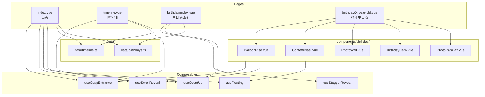

# Homepage Refactor Design

## Background & Motivation

Yang ChuRan 网站当前首页为静态展示（4 个 SVG 图标 + CSS 滚动动画），无内容预览和页面导航引导。时间轴使用 DaisyUI 原生组件无动效，生日页仅一岁且 CSS 动画硬编码。整体缺乏统一的动效体系和完善的信息架构。

需要重构为 GSAP 驱动的动效体系，让网站更有童趣活力，同时建立可维护的组件和数据架构。

## Goal

- 首页作为门户，引导用户在 3 次点击内到达任何内容页
- 全站 GSAP 动效统一为"趣味童真"风格（弹性缓动 + 浮动装饰）
- 生日页可独立设计不同风格，共享动画组件库
- 新增一年生日内容仅需：加一个 Vue 页面 + 在配置中加一条记录

## Non-Goal

- 不引入后端或 CMS
- 不做水平滚动时间轴
- 不做全站 ScrollTrigger pin 叙事
- 不使用 GSAP 付费插件（SplitText 等）
- 不重构 accordion.vue（本次搁置）

## Architecture



**数据流**：

1. 配置文件（timeline.ts / birthdays.ts）→ 页面组件读取数据 → 渲染 DOM
2. 页面 `onMounted` → 创建 `gsap.context()` → composable 在 context 内创建动画
3. 路由切换 → `onUnmounted` → `context.revert()` → 所有动画销毁

## Interface Contract

### Composables

```typescript
// useGsapContext — 页面级动画上下文管理（内部 composable，不直接暴露给页面模板）
interface GsapContextReturn {
  context: Ref<gsap.Context | null>
  prefersReduced: boolean
}
function useGsapContext(
  scope: Ref<HTMLElement | undefined>
): GsapContextReturn
// 页面根组件调用一次，子 composable 通过 provide/inject 获取 context。
// prefersReduced = true 时所有子 composable 跳过动画。

// useGsapEntrance
interface EntranceOptions {
  from?: gsap.TweenVars // 默认: { opacity: 0, scale: 0.5, y: 30 }
  duration?: number // 默认: 0.8
  ease?: string // 默认: "back.out(1.7)"
  delay?: number // 默认: 0
}
function useGsapEntrance(
  el: Ref<HTMLElement | undefined>,
  options?: EntranceOptions
): void
// 不暴露控制接口。生命周期统一由页面级 gsap.context().revert() 管理。

// useScrollReveal
interface ScrollRevealOptions {
  from?: gsap.TweenVars // 默认: { opacity: 0, y: 50 }
  duration?: number // 默认: 0.8
  ease?: string // 默认: "back.out(1.7)"
  trigger?: string // 默认: "top 85%"
}
function useScrollReveal(
  el: Ref<HTMLElement | undefined>,
  options?: ScrollRevealOptions
): void
// 不暴露控制接口。统一由 gsap.context().revert() 管理。

// useFloating
interface FloatingOptions {
  y?: number // 浮动幅度，默认: 10
  duration?: number // 单次周期，默认: 3
  ease?: string // 默认: "sine.inOut"
}
function useFloating(
  el: Ref<HTMLElement | undefined>,
  options?: FloatingOptions
): void
// 不暴露控制接口。循环动画随 gsap.context().revert() 统一销毁。

// useStaggerReveal
interface StaggerRevealOptions {
  from?: gsap.TweenVars // 默认: { opacity: 0, y: 40, scale: 0.9 }
  duration?: number // 默认: 0.6
  stagger?: number // 默认: 0.12
  ease?: string // 默认: "back.out(1.7)"
  trigger?: string // 默认: "top 85%"
}
function useStaggerReveal(
  container: Ref<HTMLElement | undefined>,
  childSelector: string,
  options?: StaggerRevealOptions
): void
// 不暴露控制接口。统一由 gsap.context().revert() 管理。

// useCountUp
interface CountUpOptions {
  duration?: number // 默认: 2（固定时长，不随数字大小变化）
  ease?: string // 默认: "power2.out"
  startVal?: number // 默认: 0
}
function useCountUp(
  el: Ref<HTMLElement | undefined>,
  target: number | Ref<number>,
  options?: CountUpOptions
): void
// 不暴露控制接口。统一由 gsap.context().revert() 管理。
// 大数字（如 1300+ 天）仍使用固定 2s duration，通过 ease 保证视觉节奏。
```

### Data Models

```typescript
// src/data/timeline.ts
interface TimelineItem {
  id: number
  date: string // 显示用日期文本，如 "2022年11月15日"
  description: string
  image: string // public/ 下的路径，如 "/images/001.jpg"
  milestone?: boolean // 里程碑标记
}

// src/data/birthdays.ts
interface BirthdayConfig {
  age: number // 几岁
  route: string // 路由路径，如 "/birthday/one-year-old"
  label: string // 显示名，如 "一岁"
  date: string // 日期，如 "2023-11-15"
  themeColor: string // 主题色，如 "#e91e63"
  icon: string // emoji 图标，如 "🎈"
  coverGradient: string // 封面渐变，如 "linear-gradient(135deg,#ffcdd2,#ef9a9a)"
}
```

### Birthday Components

```typescript
// BalloonRise.vue
interface BalloonRiseProps {
  count?: number // 气球数量，默认: 3
  colors?: string[] // 气球颜色
  delay?: number // 延迟启动，默认: 0
}

// ConfettiBlast.vue
interface ConfettiBlastProps {
  particleCount?: number // 粒子数，默认: 30
  spread?: number // 扩散半径，默认: 200
  trigger?: 'mount' | 'scroll' // 触发方式，默认: 'mount'
}

// PhotoWall.vue
interface PhotoWallProps {
  images: string[] // 照片路径数组
  columns?: number // 列数，默认: 3
}

// BirthdayHero.vue
interface BirthdayHeroProps {
  title: string // 主标题
  subtitle?: string // 副标题
  background?: string // 背景 CSS
}

// PhotoParallax.vue
interface PhotoParallaxProps {
  images: string[] // 照片路径数组
  speed?: number // 视差速度因子，默认: 0.3
}
```

## Data Model

见 Interface Contract 中的 Data Models 部分。数据为纯静态 TypeScript 文件，无数据库。

**文件位置**：

- `src/data/timeline.ts` — 导出 `timelineData: TimelineItem[]`
- `src/data/birthdays.ts` — 导出 `birthdaysData: BirthdayConfig[]`

## Non-Functional Requirements

| 维度       | 指标                                                           |
| ---------- | -------------------------------------------------------------- |
| 首屏性能   | LCP ≤ 2.5s（Vercel CDN）                                       |
| 包体积     | GSAP core + ScrollTrigger ≤ 50KB gzipped                       |
| 动画流畅度 | 所有动画 ≥ 55fps（基准：中端移动设备 Snapdragon 6 系列及以上） |
| 兼容性     | iOS Safari 15+、Android Chrome 90+、桌面主流浏览器             |
| 照片加载   | 非首屏照片 lazy loading（浏览器原生 loading="lazy"）           |
| 无障碍     | prefers-reduced-motion 开启时跳过所有动画，直接展示终态        |

## Error Handling & Degradation

| 场景                                  | 处理策略                                               |
| ------------------------------------- | ------------------------------------------------------ |
| GSAP 加载失败（JS 解析错误/网络异常） | 页面仍可阅读（静态渲染），动画不执行，不抛出阻塞性错误 |
| 图片加载失败                          | 显示粉色占位背景 + alt 文字                            |
| birthdays 配置数据格式异常            | 跳过异常条目，正常渲染其余数据                         |
| timeline 数据为空                     | 时间轴页面显示空状态提示                               |

## Alternatives Considered

| 方案                         | 优点           | 缺点                                                          | 不选原因                                     |
| ---------------------------- | -------------- | ------------------------------------------------------------- | -------------------------------------------- |
| 全站 ScrollTrigger pin 叙事  | 视觉沉浸感极强 | 开发复杂度高、iOS pin 兼容问题多、首页变巨型组件              | 移动端风险 + 维护成本不适合个人项目          |
| CSS-only 动画（不引入 GSAP） | 零额外依赖     | ScrollTrigger 无替代、stagger 难管理、生命周期 cleanup 需自建 | 功能不足以支撑设计目标                       |
| Framer Motion / Vue Motion   | Vue 生态集成好 | ScrollTrigger 能力弱、社区规模小、童趣弹性缓动表现力不如 GSAP | GSAP 在动画表现力和 ScrollTrigger 上无可替代 |

## Testing Strategy

| 测试对象                                      | 层级 | 关键用例                                                       |
| --------------------------------------------- | ---- | -------------------------------------------------------------- |
| composables（useCountUp、useGsapEntrance 等） | 单元 | 传入 ref 后动画实例创建、unmount 后实例 kill、options 覆盖生效 |
| 数据配置（timeline.ts、birthdays.ts）         | 单元 | 数据格式符合接口、必填字段非空                                 |
| 首页渲染                                      | 组件 | 三个区域正确渲染、天数计数正确、导航跳转正确                   |
| 时间轴渲染                                    | 组件 | 节点数量与数据一致、里程碑样式区分、响应式布局切换             |
| 生日索引页                                    | 组件 | 卡片数量与配置一致、倒计时计算正确、跳转路由正确               |
| 路由切换 cleanup                              | 集成 | 切换页面后无 ScrollTrigger 残留、无内存泄漏                    |
| 全流程导航                                    | E2E  | 首页→时间轴→返回→生日集→具体生日页→下一年                      |

## Milestones

| 阶段    | 产出                                                  | 依赖          |
| ------- | ----------------------------------------------------- | ------------- |
| Phase 1 | GSAP 基础设施：安装依赖 + composables 实现 + 单元测试 | 无            |
| Phase 2 | 数据层：timeline.ts + birthdays.ts                    | 无            |
| Phase 3 | 首页重构                                              | Phase 1, 2    |
| Phase 4 | 时间轴重构                                            | Phase 1, 2    |
| Phase 5 | 生日页：共享组件 + 索引页 + 各年页面                  | Phase 1, 2    |
| Phase 6 | 路由和导航更新 + cleanup 验证                         | Phase 3, 4, 5 |
