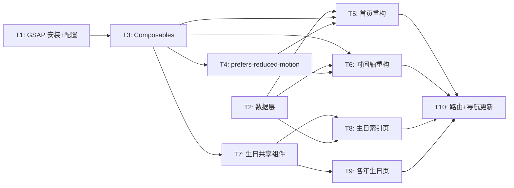

# Homepage Refactor Implementation Plan

**Goal:** 重构首页 + 时间轴 + 生日页，引入 GSAP 趣味童真动效体系
**Architecture:** GSAP composable 层封装动画逻辑 → 数据配置驱动内容 → 页面组件组合渲染 → gsap.context() 管理生命周期
**Tech Stack:** Vue 3 + GSAP (core + ScrollTrigger) + Tailwind CSS 4 + DaisyUI 5

## Dependency Graph



| Task                            | 依赖           | 可并行组 |
| ------------------------------- | -------------- | -------- |
| T1: GSAP 安装配置               | 无             | A        |
| T2: 数据层                      | 无             | A        |
| T3: Composables                 | T1             | B        |
| T4: prefers-reduced-motion 支持 | T3             | C        |
| T5: 首页重构                    | T2, T3         | C        |
| T6: 时间轴重构                  | T2, T3         | C        |
| T7: 生日共享组件                | T3             | C        |
| T8: 生日索引页                  | T2, T7         | D        |
| T9: 各年生日页                  | T7             | D        |
| T10: 路由+导航更新              | T5, T6, T8, T9 | E        |

---

### Task 1: GSAP 安装配置

**Depends on:** 无
**Files:**

- Modify: `package.json`

**Behavior:**
安装 gsap 依赖，注册 ScrollTrigger 插件。

- [ ] **Step 1: Install**

```bash
pnpm add gsap
```

- [ ] **Step 2: Verify**

Run: `pnpm build`
Expected: PASS，无类型错误

- [ ] **Step 3: Commit**

```bash
git add package.json pnpm-lock.yaml
git commit -m "feat(deps): 添加 gsap 依赖"
```

---

### Task 2: 数据层

**Depends on:** 无
**Files:**

- Create: `src/data/timeline.ts`
- Create: `src/data/birthdays.ts`

**Behavior:**
将时间轴硬编码数据提取为独立配置文件，新增生日页元数据配置。导出类型和数据。

- [ ] **Step 1: Implement**

```typescript
// src/data/timeline.ts
// 导出 TimelineItem 接口 + timelineData 数组
// 数据从现有 timeline.vue 中迁移，补充 milestone 字段

// src/data/birthdays.ts
// 导出 BirthdayConfig 接口 + birthdaysData 数组
// 包含：age, route, label, date, themeColor, icon, coverGradient
// 当前 3 年：一岁(粉红/🎈)、两岁(绿色/🌳)、三岁(蓝色/🐬)
```

- [ ] **Step 2: Verify**

Run: `pnpm type-check`
Expected: PASS

- [ ] **Step 3: Commit**

```bash
git add src/data/
git commit -m "feat(data): 添加 timeline 和 birthdays 数据配置"
```

---

### Task 3: Composables

**Depends on:** T1
**Files:**

- Create: `src/composables/useGsapContext.ts`
- Create: `src/composables/useGsapEntrance.ts`
- Create: `src/composables/useScrollReveal.ts`
- Create: `src/composables/useFloating.ts`
- Create: `src/composables/useStaggerReveal.ts`
- Create: `src/composables/useCountUp.ts`

**Behavior:**
封装 GSAP 动画逻辑为 Vue composable。useGsapContext 提供页面级 gsap.context() 创建与 revert，其余 composable 在 context 内创建动画。

- [ ] **Step 1: Implement**

```typescript
// useGsapContext.ts
// - onMounted 创建 gsap.context(scope)，scope 为组件根 el
// - onUnmounted 调用 context.revert()
// - provide context 和 prefersReduced 标记供子 composable inject
// - prefersReduced 检测留给 T4，此处默认 false

// useGsapEntrance.ts
// - inject context，watch el，元素可用时在 context 内创建 gsap.from() tween
// - 默认 from: { opacity: 0, scale: 0.5, y: 30 }, ease: "back.out(1.7)"

// useScrollReveal.ts
// - 类似 useGsapEntrance，但使用 ScrollTrigger
// - 默认 trigger: "top 85%"，动画完成后 ScrollTrigger 自动清理

// useFloating.ts
// - gsap.to() 带 yoyo: true, repeat: -1 的循环动画
// - 默认 y: 10, duration: 3, ease: "sine.inOut"

// useStaggerReveal.ts
// - gsap.from(childSelector, { stagger }) + ScrollTrigger on container
// - 默认 stagger: 0.12

// useCountUp.ts
// - gsap.to 一个内部 proxy 对象 { val: startVal } → { val: target }
// - onUpdate 时将 Math.round(val) 写入 el.textContent
```

- [ ] **Step 2: Verify**

Run: `pnpm type-check`
Expected: PASS

- [ ] **Step 3: Commit**

```bash
git add src/composables/
git commit -m "feat(animation): 实现 GSAP composable 动画层"
```

---

### Task 4: prefers-reduced-motion 支持

**Depends on:** T3
**Files:**

- Modify: `src/composables/useGsapContext.ts`

**Behavior:**
检测 prefers-reduced-motion 媒体查询。开启时所有 composable 跳过动画创建，元素直接展示终态（opacity: 1, scale: 1, transform: none）。

- [ ] **Step 1: Implement**

```typescript
// 在 useGsapContext 中：
// const prefersReduced = window.matchMedia('(prefers-reduced-motion: reduce)').matches
// 若 prefersReduced → 不创建 context，提供标记让子 composable 跳过
// 各 composable 检测标记，跳过时直接 gsap.set(el, finalState)
```

- [ ] **Step 2: Verify**

Run: `pnpm type-check`
Expected: PASS

- [ ] **Step 3: Commit**

```bash
git add src/composables/
git commit -m "feat(a11y): 支持 prefers-reduced-motion 跳过动画"
```

---

### Task 5: 首页重构

**Depends on:** T2, T3
**Files:**

- Modify: `src/pages/index.vue`

**Behavior:**
重构首页为三屏结构：Hero（照片弹入 + 文字 stagger + 天数 countUp + 浮动装饰）→ 精选预览（最新里程碑 + 倒计时）→ 导航入口卡片。使用 composable 驱动所有动画。

- [ ] **Step 1: Implement**

```
// 结构：
// <section> Hero
//   - 照片区：useGsapEntrance (scale 弹入)
//   - 标题：手动 span 拆分 + useStaggerReveal
//   - 天数：useCountUp
//   - 装饰元素：useFloating
//   - 问候语：计算属性根据小时切换
//     时段规则：0-5 凌晨 / 6-11 早上 / 12-17 下午 / 18-23 晚上
//
// <section> 精选预览
//   - 从 timelineData 取最后 3 条 → useStaggerReveal
//   - 倒计时：计算距下一个生日天数 → useCountUp
//   - timelineData 为空时此区块不渲染
//
// <section> 导航入口
//   - 卡片列表 → useStaggerReveal
//   - 桌面端 hover：GSAP scale(1.05) + boxShadow 增强
//   - 跳转：RouterLink to /timeline, /birthday

// 照片使用 loading="lazy"（非 hero 区的照片）
// 图片 error 时显示粉色占位 + alt
```

- [ ] **Step 2: Verify**

Run: `pnpm build`
Expected: PASS

- [ ] **Step 3: Commit**

```bash
git add src/pages/index.vue
git commit -m "feat(home): 重构首页三屏结构 + GSAP 动效"
```

---

### Task 6: 时间轴重构

**Depends on:** T2, T3
**Files:**

- Modify: `src/pages/timeline.vue`

**Behavior:**
重构时间轴为垂直 ScrollTrigger 逐节点入场。桌面端左右交替，移动端单侧。里程碑节点强调样式。数据从 timeline.ts 读取。

- [ ] **Step 1: Implement**

```
// 结构：
// 标题区：useGsapEntrance
// 时间线主体：
//   - v-for timelineData
//   - 奇偶交替布局（md 以上左右，以下全右）
//   - 每个节点 ref → useScrollReveal，from 方向根据奇偶决定（x: -60 或 x: 60）
//   - 圆点：useScrollReveal (scale 弹出)
//   - milestone 节点：大圆点 + 强调色 + 脉冲动画（useFloating scale 变体）
//   - 照片：loading="lazy" + error fallback
```

- [ ] **Step 2: Verify**

Run: `pnpm build`
Expected: PASS

- [ ] **Step 3: Commit**

```bash
git add src/pages/timeline.vue
git commit -m "feat(timeline): 重构为 GSAP ScrollTrigger 垂直时间轴"
```

---

### Task 7: 生日共享组件

**Depends on:** T3
**Files:**

- Create: `src/components/birthday/BalloonRise.vue`
- Create: `src/components/birthday/ConfettiBlast.vue`
- Create: `src/components/birthday/PhotoWall.vue`
- Create: `src/components/birthday/BirthdayHero.vue`
- Create: `src/components/birthday/PhotoParallax.vue`

**Behavior:**
实现 5 个共享生日动画组件，内部使用 composable 驱动动画，接收 props 配置。

- [ ] **Step 1: Implement**

```
// BalloonRise.vue
//   - props: count, colors, delay
//   - 生成 count 个绝对定位气球元素（SVG 或 emoji）
//   - 每个气球：gsap.from({ y: '100vh', rotation: random(-20,20) })
//     ease: "elastic.out(1, 0.5)", stagger: 0.2
//   - 到位后 useFloating 做微摆

// ConfettiBlast.vue
//   - props: particleCount, spread, trigger
//   - 生成 particleCount 个小方块（随机颜色/旋转）
//   - trigger=mount 时立即爆发，=scroll 时 ScrollTrigger 触发
//   - gsap.to 每个粒子：随机方向 + 重力下落 + fadeOut

// PhotoWall.vue
//   - props: images, columns
//   - CSS grid columns 列布局
//   - useStaggerReveal 子图片逐张弹入
//   - 图片 loading="lazy" + error fallback

// BirthdayHero.vue
//   - props: title, subtitle, background
//   - 全屏高度容器 + background 样式
//   - title 手动 span 拆分 + useStaggerReveal 逐字弹入
//   - subtitle useGsapEntrance 淡入

// PhotoParallax.vue
//   - props: images, speed
//   - 每张图独立 ScrollTrigger，y 位移 = scrollProgress * speed * 100
//   - 形成不同速度的视差效果
```

- [ ] **Step 2: Verify**

Run: `pnpm type-check`
Expected: PASS

- [ ] **Step 3: Commit**

```bash
git add src/components/birthday/
git commit -m "feat(birthday): 实现共享 GSAP 动画组件库"
```

---

### Task 8: 生日索引页

**Depends on:** T2, T7
**Files:**

- Create: `src/pages/birthday/index.vue`

**Behavior:**
替代原 countdown.vue，展示顶部倒计时（距下一个生日）+ 年份卡片列表。数据从 birthdays.ts 读取。

- [ ] **Step 1: Implement**

```
// 结构：
// 顶部：倒计时区域
//   - 计算距下一个生日的天/时/分/秒
//   - useCountUp 天数动画
//
// 下方：年份卡片网格
//   - v-for birthdaysData
//   - 每张卡片：coverGradient 背景 + icon + label + date
//   - 日期解析容错：无效 date 字段时不显示日期，卡片其余部分正常渲染
//   - RouterLink to item.route
//   - useStaggerReveal 入场
//   - birthdaysData 为空时卡片区不渲染
```

- [ ] **Step 2: Verify**

Run: `pnpm build`
Expected: PASS

- [ ] **Step 3: Commit**

```bash
git add src/pages/birthday/index.vue
git commit -m "feat(birthday): 新增生日集索引页"
```

---

### Task 9: 各年生日页

**Depends on:** T7
**Files:**

- Modify: `src/pages/birthday/one-year-old.vue`
- Create: `src/pages/birthday/two-year-old.vue`
- Create: `src/pages/birthday/three-year-old.vue`

**Behavior:**
重构一岁页，新建二岁、三岁页。每页三段式（Hero + 照片 + 祝福导航），使用共享组件组合，各自不同主题色和素材。

- [ ] **Step 1: Implement**

```
// one-year-old.vue（重构）
//   - BirthdayHero: title="Happy 1st Birthday!", 粉红主题
//   - BalloonRise + ConfettiBlast
//   - PhotoWall 或 PhotoParallax（复用现有 one-year-old 照片）
//   - 底部祝福 + 导航到 two-year-old / 首页

// two-year-old.vue（新建）
//   - BirthdayHero: title="Happy 2nd Birthday!", 绿色主题
//   - BalloonRise(colors: greens) + ConfettiBlast
//   - PhotoParallax
//   - 底部导航

// three-year-old.vue（新建）
//   - BirthdayHero: title="Happy 3rd Birthday!", 蓝色主题
//   - BalloonRise(colors: blues) + ConfettiBlast
//   - PhotoWall
//   - 底部导航（无"下一年"按钮，仅回首页）
```

- [ ] **Step 2: Verify**

Run: `pnpm build`
Expected: PASS

- [ ] **Step 3: Commit**

```bash
git add src/pages/birthday/
git commit -m "feat(birthday): 重构一岁页 + 新增二岁三岁页"
```

---

### Task 10: 路由+导航更新

**Depends on:** T5, T6, T8, T9
**Files:**

- Modify: `src/components/home-navbar.vue`
- Delete: `src/pages/countdown.vue`

**Behavior:**
更新导航栏链接（"生日惊喜"→"生日集"，路由指向 /birthday）。删除 countdown.vue（已被索引页替代）。验证全站路由跳转正常。

- [ ] **Step 1: Implement**

```
// home-navbar.vue：
//   - "生日惊喜" → "生日集"，RouterLink to="/birthday"
//   - 保留"首页"和"成长记录"

// 删除 src/pages/countdown.vue
```

- [ ] **Step 2: Verify**

Run: `pnpm build`
Expected: PASS，无 dead import 或路由错误

- [ ] **Step 3: Commit**

```bash
git add src/components/home-navbar.vue
git rm src/pages/countdown.vue
git commit -m "feat(nav): 更新导航结构，删除 countdown 页"
```
